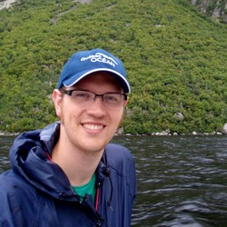
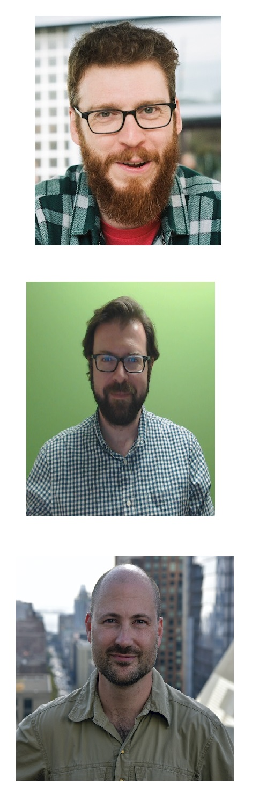

```{r setup, include=FALSE}
knitr::opts_chunk$set(echo = FALSE)
```


# Before we get started:

* Make sure you have R open, and the working directory set to where you put the files we sent out

  * If you are in RStudio, you can just open the project file

--

* The following packages should be installed:

  * `dplyr` and `tidyr` for data manipulation
  * `ggplot2` for visualization
  * `gratia` (for visualizing GAMs)

---

# Who I am


.left-column[ 
```{r}


```

]

.right-column[
Assistant professor at Concordia University in Montreal. I study rapid change in aquatic ecosystems, and developing methods for monitoring spatially structured communities
]


---

# This workshop would not be possible  except for these fantastic people:


.left-column[ 

```{r}


```
]

.right-column[


.small[David Lawrence Miller (Centre for Research into Ecological & Environmental Modelling, St Andrews University)]

----------------------------

.small[Gavin Simpson (Department of Animal Science, Aarhus University)]

----------------------------

.small[Noam Ross (Ecohealth Alliance)]


----------------------------


]


---


# How I'll be running the workshop:

* Three sessions over 3 days

--

* Each session will include:

  * A short presentation on theory
  * Live coding
  * Exercises

--


* The presentation will be recorded, and I'll provide answers to the exercises after each day

---


# How I'll be running the workshop:


**Day 1 (today): What's a GAM?** 

  *  Intro to GAM theory: basis functions and smoothing

  * Some useful types of smoothers

--

**Day 2 (Thursday): extending GAMs **

  * Choosing families to model complex data
  
  * multi-dimensional smoothers and interactions

--

**Day 3 (next Tuesday):  **

  * Making predictions and evaluating uncertainty

  * Model selection and mispecification testing

---


# How I'll be running the workshop:


* If you have any questions, raise your hand or put a question in chat; 
I'll be checking the chat regularly

--

* We'll take a break after the first hour and 15 min 


---


# Now on to the workshop! 
